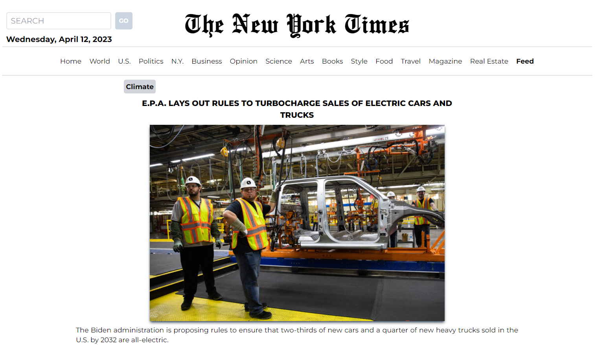
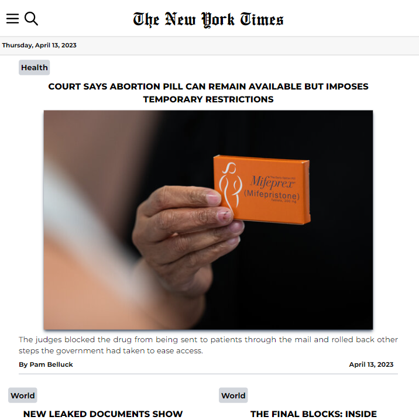
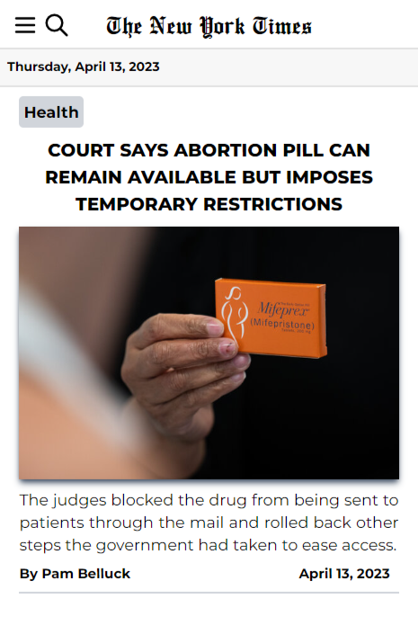

<h1> New York Times Clone </h1>

React Project for Full Stack Development course of [start2impact](https://www.start2impact.it).

Live Demo: https://newyorktimes-clone.netlify.app/

<h2>Table of Contents</h2>

- [Features](#features)
- [Screenshots](#screenshots)
- [Contact](#contact)

<h3>Technologies Used</h3>

- HTML 5 
- [Tailwind CSS](https://tailwindcss.com/)
- Javascript 
- [React](https://react.dev/)
- [Create React App](https://create-react-app.dev/)
- [React Router](https://reactrouter.com/en/main)
- [React Icons](https://www.npmjs.com/package/react-icons)
- [axios](https://axios-http.com/)             
- [React Spinners](https://www.npmjs.com/package/react-spinners)
- [New York Times API](https://developer.nytimes.com/)

## Features

- Responsive design
- Current top stories are displayed in the homepage
- Different news topic chosen from menù in mobile and tablet views, in desktop the topic are in the navbar
- FeedPage different from the others
- Ability to search news by keyword

## Screenshots

<h4>Desktop View</h4> 

<h4>Tablet View</h4> 

<h4>Mobile View</h4> 

## Contact

Created by Marco Giuliani: &nbsp; 

- [Website](https://marcogiu.github.io/myWebsite/) &nbsp; 
- [Linkedin](https://www.linkedin.com/in/marco-giuliani-2a20b4179/) &nbsp; 
- [Twitter](https://twitter.com/Marco02351182) &nbsp; 
